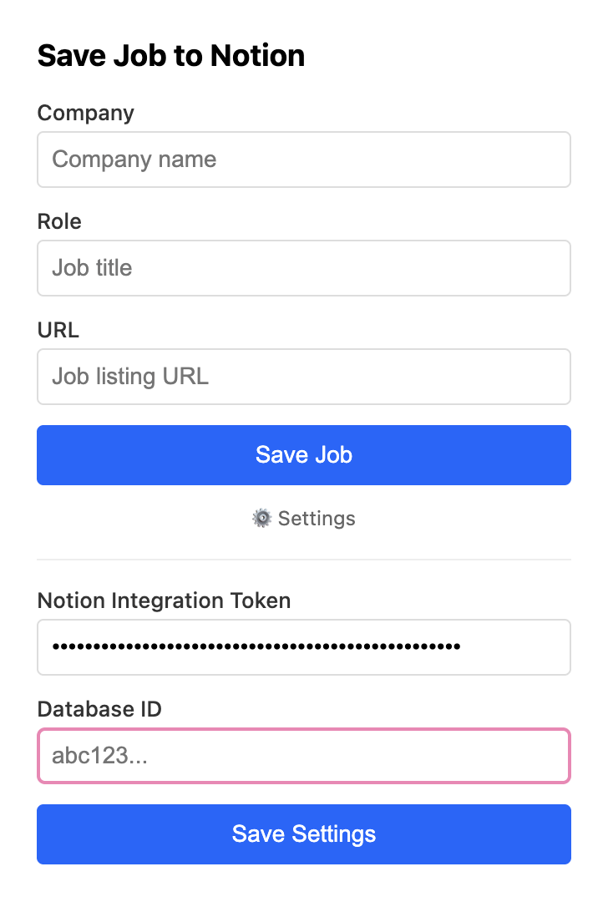
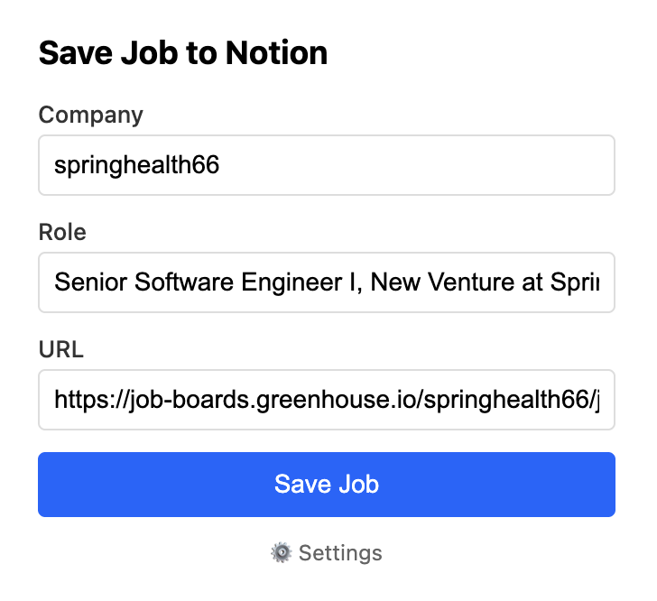

# Simple Chrome extension to save a job to Notion database

Inspired by my job search and my love of Notion.

NOTE: Intended for use with Greenhouse, Lever, and Ashby. Not tested with other career sites.

## How to use
1. Create a Notion database. Update popup.js with the fields you want to use.

2. Create a [Notion integration](https://www.notion.so/profile/integrations). Make sure the integration has access to the Notion database under the 'Access' tab.

3. Unpack the extension in Google Chrome.

4. Open the extension and copy the Notion integration token and database id into settings. Click 'Save Settings'.

5. Navigating to job on Greenhouse, Lever, or Ashby should prefill job information! Edit as needed.

6. Click 'Save Job' to add the job information as a new database entry

## Resources
- [Chrome extension docs](https://developer.chrome.com/docs/extensions)
- [Claude](https://claude.ai/)
